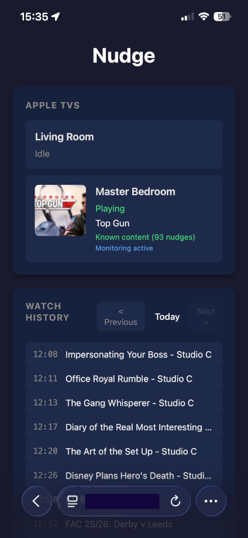
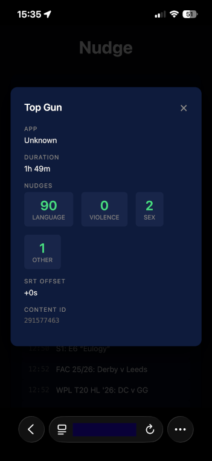

<p align="center">
  
</p>

# Nudge

Automatically skip objectionable content on your AppleTV.
<div style="height: 16px;"></div>
<p align="center" style="display:flex; justify-content:center; gap:12px;">
  
  
</p>

## The Problem

You want to watch a great movie with your family, but it has a few scenes with language or content you'd rather skip. Streaming services don't offer granular content filters, and constantly reaching for the remote breaks immersion.
I'm a Christian, and nudge primarily solves my personal requirements.


## The Solution

Nudge monitors your AppleTV and automatically skips past objectionable content. It works with any streaming app - Netflix, Prime Video, Apple TV+, Disney+, and more.

**Two types of skips:**

- **Language** - Automatically detected from subtitles using your wordlist
- **Scenes** - Manually marked violence, sex, or other content

## How It Works

```
┌─────────────┐     ┌─────────────┐     ┌─────────────┐
│  AppleTV    │────▶│   Nudge     │────▶│   Skip!     │
│  Playing    │     │   Service   │     │   Forward   │
└─────────────┘     └─────────────┘     └─────────────┘
                           │
                    ┌──────┴──────┐
                    │  Content    │
                    │  Database   │
                    └─────────────┘
```

1. **Monitor** - Nudge connects to your AppleTV and watches playback position
2. **Match** - When content plays, Nudge looks up its nudge configuration
3. **Skip** - When playback reaches a nudge point, Nudge jumps forward past it

The skip happens fast enough that you barely notice - just a brief jump forward.

## Setup

```bash
# Clone and run
git clone https://github.com/yourusername/nudge.git
cd nudge

# Find and pair with your AppleTV
uv run nudge pair

# Test subtitles (while movie is playing)
uv run nudge test ~/Downloads/movie.srt

# Make minor adjustments, if necessary
uv run nudge test ~/Downloads/movie.srt --offest 2

# Add content
uv run nudge test ~/Downloads/movie.srt --offest 2 --save

# List known content
uv run nudge list

# Manually add additional nudges by editing the content file for the title

# Start the service
uv run nudge start
```

See [QUICKSTART.md](QUICKSTART.md) for detailed setup instructions.

## Documentation

| Document | Description |
|----------|-------------|
| [QUICKSTART.md](QUICKSTART.md) | Step-by-step setup guide |
| [DATA.md](DATA.md) | Data formats and configuration |
| [ROADMAP.md](ROADMAP.md) | Planned features |

## Commands

| Command | Description |
|---------|-------------|
| `uv run nudge scan` | Find AppleTVs on network |
| `uv run nudge pair` | Pair with an AppleTV |
| `uv run nudge test <srt>` | Test subtitle timing |
| `uv run nudge test <srt> --save` | Save content configuration |
| `uv run nudge list` | List saved content |
| `uv run nudge nudges <title>` | View nudges for content |
| `uv run nudge verify <title>` | Verify content loads without errors |
| `uv run nudge simulate <title>` | Rapidly test all nudges on device |
| `uv run nudge export` | Export content database to zip |
| `uv run nudge import <zip>` | Import content database from zip |
| `uv run nudge start` | Start background service |
| `uv run nudge stop` | Stop service |
| `uv run nudge status` | Check service and device status |
| `uv run nudge on/off` | Enable/disable skipping |

## Web Interface

Nudge includes a web interface at http://localhost:8080 showing:

- Connected AppleTVs and what's playing
- Matched content with nudge counts
- Service status and controls

## Requirements

- macOS or Linux
- Python 3.10+
- AppleTV (4th generation or later)
- Network access to AppleTV

## How Content Matching Works

When you play something on your AppleTV, Nudge identifies it by:

1. **Store ID** - iTunes/content store identifier (most reliable)
2. **Hash** - SHA256 of title + duration + app name (fallback)

This means the same movie from different apps may need separate configurations, but content with store IDs (purchased/rented from Apple) will match across sessions.

## License

Apache-2.0 - See [LICENSE](LICENSE)
